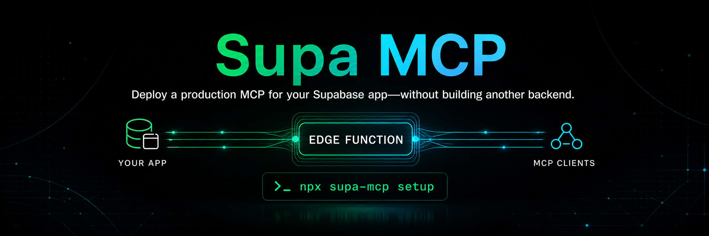

# Supa MCP

**Deploy a production MCP for your Supabase app—without building another
backend.**

Supa MCP turns capabilities from an existing Supabase application into a
Streamable HTTP MCP server running as a Supabase Edge Function. Your application
keeps its Auth, Postgres data, Row Level Security, Storage, and authorization
model. MCP becomes another interface to the product you already built.

This package is for application builders exposing their own product to users
and agents. It is not the official Supabase management MCP used to administer
Supabase projects.

```text
MCP client
    ↓
Supabase Edge Function
    ↓
request-scoped identity and Supabase client
    ↓
your capabilities, Postgres data, and RLS policies
```

## Start in one command

From a repository that already contains `supabase/config.toml`:

```sh
npx supa-mcp setup
```

Setup asks who may connect, previews every file it will write, generates the
Edge Function and tests, and reports the remaining deployment or OAuth steps in
order. It is resumable and does not overwrite application-authored
capabilities.

Requirements: Node 22+, the Supabase CLI, and preferably Deno for the generated
local type-check and tests.

The generated server lives at:

```text
supabase/functions/mcp/
├── index.ts
├── capabilities.ts
├── deno.json
├── index_test.ts
└── README.md
```

## Write one capability

Edit the generated `capabilities.ts`. Supa MCP uses the official MCP SDK's
registration API; it does not introduce another tool framework.

```ts
import {
  textResult,
  type SupabaseMcpContext,
  type SupabaseMcpServer,
} from "supa-mcp";
import { z } from "zod";

export function registerCapabilities(
  server: SupabaseMcpServer,
  ctx: SupabaseMcpContext,
) {
  server.registerTool(
    "list_projects",
    {
      description: "List projects visible to the connected user.",
      inputSchema: z.object({}),
    },
    async () => {
      const { data, error } = await ctx.supabase
        .from("projects")
        .select("id, name, status")
        .order("name");

      if (error) throw error;
      if (!data?.length) {
        return textResult(
          "No projects are visible.\n\n→ Next: create_project starts one.",
        );
      }

      return textResult(
        [
          `## Projects — ${data.length}`,
          ...data.map(
            (project) =>
              `- **${project.name}** — ${project.status} · ID: ${project.id}`,
          ),
          "",
          "→ Next: get_project reads one in full.",
        ].join("\n"),
      );
    },
  );
}
```

The important part is `ctx.supabase`. In OAuth and bearer modes, it is a fresh
client carrying the connected user's access token, so the same Postgres grants
and RLS policies used by the rest of the application apply to every tool call.

Supa MCP does not infer tools from tables or prescribe an application schema.
Builders define useful application operations and return only the information
their consumers need.

## Run, deploy, and verify

Run the generated checks and exercise MCP discovery locally:

```sh
supabase functions serve mcp
deno task --config supabase/functions/mcp/deno.json test
npx supa-mcp doctor --url http://127.0.0.1:54321/functions/v1/mcp
```

Then deploy and probe the hosted endpoint:

```sh
supabase functions deploy mcp --no-verify-jwt

npx supa-mcp doctor \
  --url https://PROJECT_REF.supabase.co/functions/v1/mcp
```

The generated function sets `verify_jwt = false` at the Supabase gateway so the
function can issue the MCP OAuth challenge itself. Protected servers still
authenticate the request inside the Supa MCP runtime.

Your MCP URL is:

```text
https://PROJECT_REF.supabase.co/functions/v1/mcp
```

## Choose who can connect

| Access mode | Use it when                                                                             | Request authority                                                   |
| ----------- | --------------------------------------------------------------------------------------- | ------------------------------------------------------------------- |
| **OAuth**   | Product users should connect their own accounts. Recommended for a user-facing product. | Supabase user token and existing RLS                                |
| **API key** | You want the shortest authenticated start or already maintain application keys.         | Application-verified subject and scopes; no fictional Supabase user |
| **Bearer**  | Your own client already holds a Supabase user access token.                             | Supabase user token and existing RLS                                |
| **Public**  | The capability is intentionally anonymous.                                              | Supabase `anon` role plus a generated Postgres rate-limit guardrail |

Run `npx supa-mcp setup` interactively, or choose directly:

```sh
npx supa-mcp setup --auth oauth
npx supa-mcp setup --auth api-key
npx supa-mcp setup --auth bearer
npx supa-mcp setup --auth public
```

Start with OAuth for an end-user product and API key for a prototype or trusted
machine caller. One endpoint can also compose Supabase-user and application-key
strategies without merging their identities or database behavior.

[Choose an access mode](./docs/reference/auth-modes) explains the tradeoffs and
[Different capability surfaces](./docs/patterns/privileged-capabilities) shows
ordinary and privileged identities receiving different MCP surfaces from one
Edge Function.

## Connect a real client

For Claude Code:

```sh
claude mcp add --transport http my-app \
  https://PROJECT_REF.supabase.co/functions/v1/mcp
```

OAuth mode opens the application's sign-in and consent flow. API-key and bearer
clients send their credential as an `Authorization: Bearer` header.

For claude.ai or Claude Desktop, open **Settings → Connectors → Add custom
connector** and paste the endpoint URL. Hosted custom connectors require OAuth
with dynamic client registration enabled.

Cursor, MCP Inspector, and other Streamable HTTP clients use the same endpoint.
See [Connect your MCP client](./docs/reference/connect-clients) for exact setup
and verified combinations.

## Why this is production-shaped

- **One backend boundary.** Auth, RLS, Postgres, Storage, and Edge Functions
  remain authoritative; Supa MCP does not create a parallel control plane.
- **Request isolation.** Every request receives a new MCP server, normalized
  principal, and Supabase client. Caller identity never lives in shared mutable
  module state.
- **Deliberate authentication.** Supabase users retain an RLS-aware client.
  Application keys retain an application-owned subject and scopes without
  being converted into a fake user.
- **Rotation-safe verification.** OAuth and bearer requests use Supabase's
  public JWKS. Remote JWKS configuration is cached briefly per runtime to avoid
  adding a key-network round trip to every MCP request while still observing
  signing-key rotation quickly.
- **Old and new project keys work.** Current publishable and secret keys are
  preferred when configured. Established Edge Function projects that still
  receive `SUPABASE_ANON_KEY` and `SUPABASE_SERVICE_ROLE_KEY` are detected
  automatically, without exposing either credential.
- **Honest, safe diagnostics.** Invalid credentials remain `invalid_token`.
  Post-verification setup failures return `server_error`; `onError` reports the
  `runtime` phase with a secret-safe configuration message for operators and
  coding agents.
- **Explicit result contracts.** Agent-facing text, typed data, hybrids, and
  large Resources are separate choices rather than automatic duplicated output.
- **Protocol-native capabilities.** Tools, Resources, prompts, instructions,
  and multi-round-trip flows use the official MCP SDK surface.
- **Deployable defaults.** Setup is previewable, resumable, conflict-aware, and
  usable non-interactively by agents and CI. `doctor` verifies the real remote
  MCP boundary.
- **Works with an ordinary Supabase project.** The runtime needs no Supa MCP
  cloud service or separate application server. Public mode's default guardrail
  is Postgres-backed.

## Choose the result for its consumer

| Helper                            | Use it for                                                              |
| --------------------------------- | ----------------------------------------------------------------------- |
| `textResult(text)`                | Purpose-written output for agents and people                            |
| `structuredResult(value)`         | Typed clients or UI consumers; declare the matching tool `outputSchema` |
| `renderResult(value, render)`     | A deliberate text and structured-data hybrid                            |
| `resourceResult(text, link)`      | A concise reading card whose full body is served through MCP Resources  |
| `errorResult(message, nextStep?)` | A failure that tells the agent how to recover                           |

Do not mirror raw database rows as an MCP contract by default. Shape the result
around the consumer's next reasoning or interaction step, preserve useful
identifiers, and use Resources or pagination for large payloads.

[Model-facing results](./docs/patterns/model-facing-results) contains executable
examples of all result patterns.

## Opt into small durable state

Most Supa MCP servers should remain stateless. When a capability genuinely
needs request-to-request coordination—such as proving that an editor read a
document before writing it—generate one allowlisted state namespace:

```sh
npx supa-mcp setup \
  --auth oauth \
  --state-namespace file-ide.observations
```

This adds one opt-in migration and state configuration. Apply the migration and
set a unique deployment secret of at least 32 random bytes:

```sh
supabase db push
supabase secrets set \
  SUPA_MCP_STATE_HMAC_KEY="replace-with-at-least-32-random-bytes"
```

Authenticated capability code then receives a deliberately small API:

```ts
const observed = await ctx.state?.get(
  "file-ide.observations",
  "/research/notes.md",
);

const advanced = await ctx.state?.put(
  "file-ide.observations",
  "/research/notes.md",
  {
    value: { versionId: "version-2" },
    expectedRevision: observed?.revision ?? null,
  },
);
```

The runtime derives an opaque partition from the exact authenticated credential
using a deployment-secret HMAC. Application code chooses only a configured
namespace and bounded object key; it cannot read or supply caller identity.
Credential rotation therefore safely appears as missing state. State values,
keys, TTLs, and namespaces are bounded, and writes/deletes use atomic revisions.
Each write also reclaims at most 16 expired rows through the expiry index, so
unreachable rotated-credential partitions are collected in bounded batches.

The implementation uses a service-role client internally because the state
table is private and its RPCs are denied to `anon` and `authenticated`. That
client is operationally broad, but it is closure-confined: it is never placed
on `ctx`, returned to a capability, or included in errors. Public mode never
receives state.

This is not a resident Durable Object or actor runtime. A future actor layer
could add mailboxes, serialized command execution, alarms, and Realtime
delivery on top of this revisioned storage substrate after a real adopter
proves those needs.

## Optional depth when the application needs it

The ordinary path remains one Edge Function with builder-authored capabilities.
The same library also supports more demanding applications without changing
that starting point:

- [Many MCPs from one function](./docs/patterns/many-mcps-one-function)
- [Authenticated tools with RLS](./docs/patterns/authenticated-tools)
- [Different capability surfaces](./docs/patterns/privileged-capabilities)
- [Interactive MCP Apps on Supabase](./docs/patterns/mcp-apps-on-supabase)
- [Clean client-facing URLs](./docs/reference/clean-urls)
- Project-local capability guidance with `npx supa-mcp skill install`

These are composition patterns, not additional frameworks or required product
architecture.

## Living proof

This repository includes an open-source Supabase reference project. Its
patterns run through the real MCP transport against local Postgres and a hosted
deployment. The suite covers two-user RLS isolation, explicit result contracts,
many row-defined MCP surfaces, composed user and application identities, and an
authenticated MCP App rendered and mutated through Claude.

The public documentation MCP is available at:

```text
https://dxrpeagddrpbezbkgvdv.supabase.co/functions/v1/docs-mcp
```

Its tools search Supa MCP's own guides and return complete documents through
MCP Resources. It links to official Supabase documentation for the platform
underneath instead of reproducing it.

To rebuild the reference project from a clean clone:

```sh
pnpm install --frozen-lockfile
pnpm reference:check
```

## Documentation

- [Five-step getting started guide](./docs/reference/getting-started)
- [Choose an access mode](./docs/reference/auth-modes)
- [Connect an MCP client](./docs/reference/connect-clients)
- [Give an MCP a clean product URL](./docs/reference/clean-urls)
- [Runnable patterns](./docs/patterns)
- [Examples](./examples)
- [Architecture and protocol contract](./SPEC.md)
- [Roadmap](./ROADMAP.md)
- [Changelog](./CHANGELOG.md)

For automation, use `npx supa-mcp setup --plan --json` to inspect changes and
`--yes --json` to apply them without prompts. Run `npx supa-mcp --help` for the
complete command reference.

## Development

```sh
pnpm install --frozen-lockfile
pnpm check
pnpm format:check
pnpm reference:check
npm pack --dry-run
```

Released under the [MIT License](./LICENSE).
